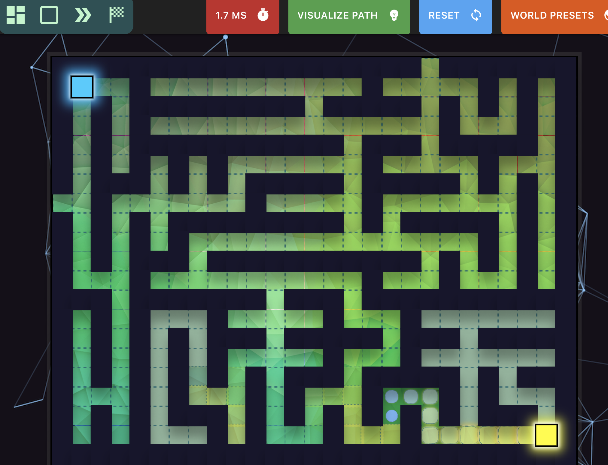

# Pathfinder Visualizer

Interactive pathfinding visualizer built with React. It supports multiple algorithms, grid editing, and animated solving.



## Features

- Algorithms: A*, Dijkstra, BFS, DFS
- Grid presets: random, empty grid, maze generation
- Interactive editing: walls, start node, end node
- Animated visited/path rendering with runtime display

## Run Locally

Install dependencies:

```bash
npm install
```

Start development server:

```bash
npm start
```

## Scripts

- `npm start`: start development server
- `npm run build`: create production build
- `npm test`: run tests
- `npm run lint`: run ESLint
- `npm run lint:fix`: auto-fix lint issues
- `npm run format`: format code with Prettier

## Project Structure

- `src/Solver`: pathfinding algorithms and graph helpers
- `src/Game`: grid rendering components
- `src/NavBar`: controls and algorithm/preset selectors
- `src/PathVisualizer.js`: main visualizer orchestration logic

## Notes

This project uses `react-scripts` and is compatible with modern Node runtimes after dependency updates in this repository.
